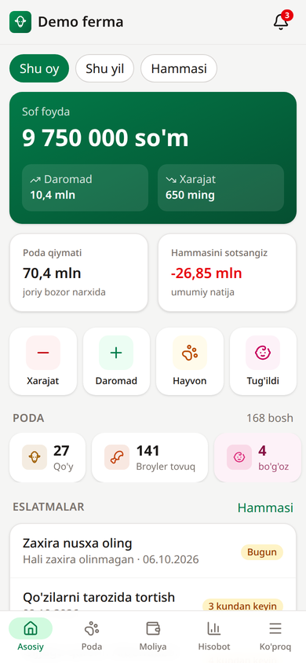
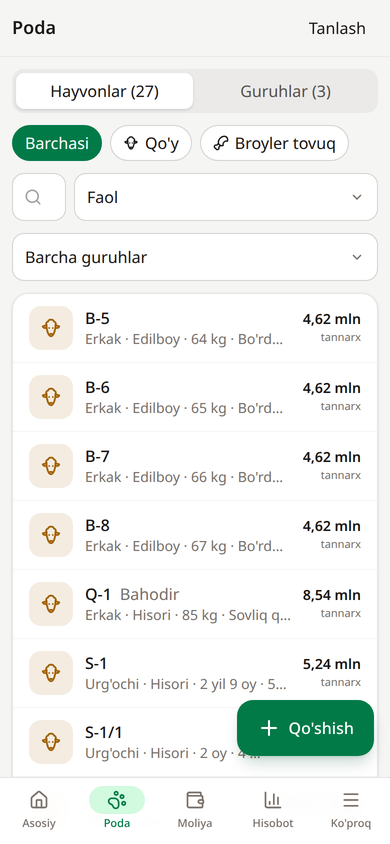
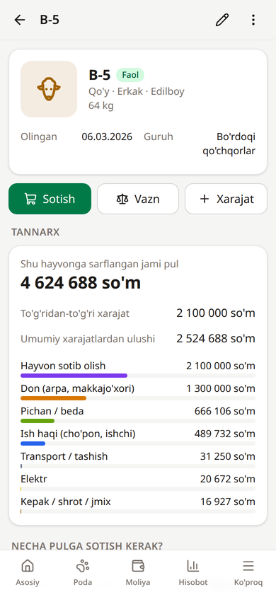
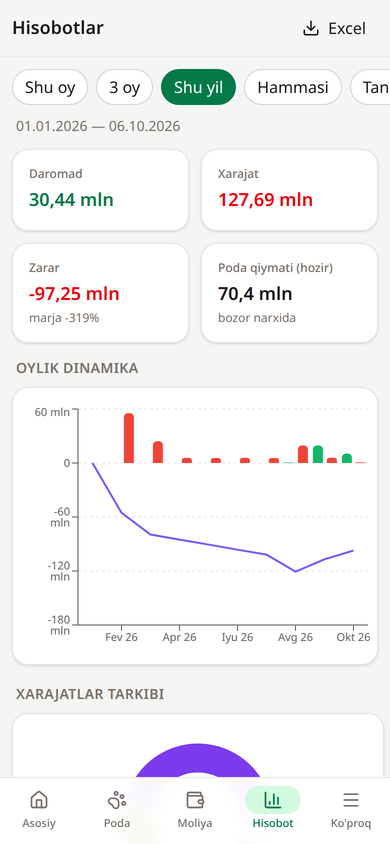
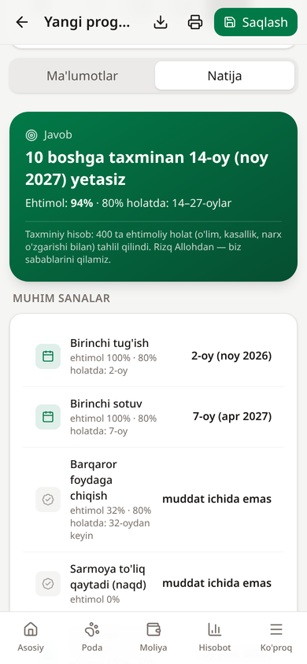
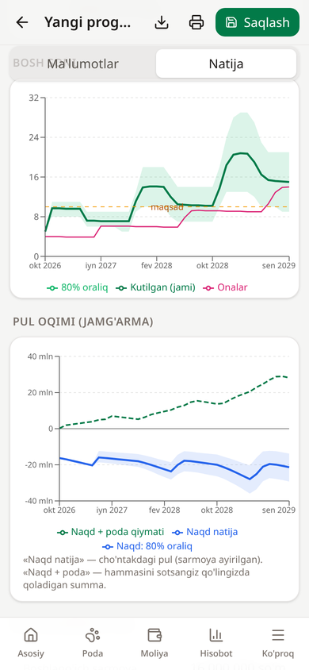
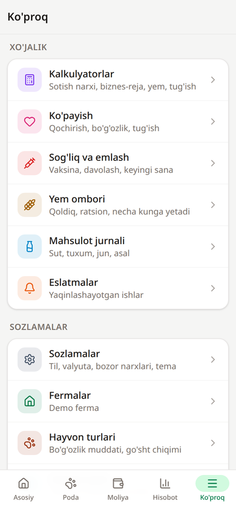

<div align="center">


# Chorva Hisob

**Chorvachilik uchun xarajat, daromad va foyda hisobi**

Qo'y, echki, qoramol, ot, tuya, parranda, quyon, baliq va asalarichilik uchun.
Har bir hayvonning tannarxi, zararsiz sotish narxi va sof foydani avtomatik hisoblaydi.

[](https://github.com/aFeruz/chorvachi/releases/latest)


[](LICENSE)

[**APK yuklab olish**](https://github.com/aFeruz/chorvachi/releases/latest) · [Imkoniyatlar](#imkoniyatlar) · [Ishga tushirish](#kompyuterda-ishga-tushirish) · [Android](#android-apk)

</div>

---

<p align="center">
  
  
  
</p>
<p align="center">
  
  
  
  
</p>

## Nima uchun?

Chorvador ko'pincha "shu qo'yni necha pulga sotsam foyda qilaman?" degan savolga aniq javob bera olmaydi: yem, cho'pon haqi, vet xizmati, elektr — barchasi umumiy cho'ntakdan ketadi. **Chorva Hisob** har bir xarajatni hayvonlar o'rtasida adolatli taqsimlaydi va har bir bosh uchun aniq tannarx, zararsiz narx va foydani ko'rsatadi.

- Internet kerak emas — hammasi telefonda ishlaydi
- Server, ro'yxatdan o'tish, reklama yo'q
- O'zbek va rus tillarida, so'mda (xohlasangiz dollarda ham)

## Imkoniyatlar

### Poda
- Yirik hayvonlar **alohida** hisoblanadi (sirg'a raqami, zot, jins, yosh, rasm, vazn tarixi, ona/ota); parranda, quyon, baliq va asalari **guruh** bo'lib (bosh soni, kirim, o'lim, sotish)
- Bir yo'la bir nechta hayvon qo'shish (Q-1 … Q-30), guruhlarga ajratish, qidirish va filtrlar
- Holatlar: faol, sotilgan, so'yilgan, o'lgan, yo'qolgan

### Tannarx va narx
- **Avtomatik tannarx** — har bir xarajat yozilgan kunda fermada bor hayvonlarga bo'linadi: bitta hayvon / guruh / tur / butun ferma
- Butun ferma xarajati **shartli bosh** bo'yicha bo'linadi (1 sigir ≈ 7 qo'y ≈ 100 tovuq) — tovuqqa sigirchalik xarajat tushmaydi
- **Zararsiz narx**: 1 bosh, 1 kg tirik vazn, 1 kg go'sht (so'yish chiqimi bilan)
- **Istalgan foyda %** bo'yicha sotish narxi va joriy bozor narxida "hozir sotsam qancha foyda/zarar"
- **Sotish oynasi**: tirik vazn, go'sht yoki kelishilgan narx; bozor yig'imi va transport; foyda va ROI darhol ko'rinadi

### Ko'payish va o'sish
- Qochirish yozilsa, **tug'ish sanasi avtomatik** hisoblanadi va eslatma qo'yiladi
- Tug'ish yozilganda **tirik bolalar podaga o'zi qo'shiladi** (onaning guruhiga)
- Qo'zilash %, bo'g'ozlik darajasi, o'lik tug'ilish, o'rtacha bola soni
- Kunlik vazn qo'shish, 1 kg o'sish tannarxi, yem konversiyasi (FCR)
- **"Boqish yoki sotish"** tavsiyasi — keyingi oy vazn o'sishi xarajatni qoplaydimi

### Moliya va xo'jalik
- 26 ta xarajat va 11 ta daromad kategoriyasi (o'zingiz qo'sha olasiz), "narx × miqdor" rejimi
- **Yem ombori**: qoldiq, o'rtacha narx, kunlik ratsion, "necha kunga yetadi" ogohlantirishi
- **Sog'liq**: emlash, davolash, gijjaga qarshi ishlov; keyingi sana eslatmasi; narxi xarajatga yoziladi
- **Mahsulot jurnali**: sut, tuxum, jun, asal, go'ng — sotilganda daromadga aylantiriladi
- Bir nechta ferma (xo'jalik) yuritish

### Hisobotlar va kalkulyatorlar
- Foyda/zarar, oylik dinamika, xarajatlar tarkibi, poda harakati, guruhlar va sotilgan hayvonlar rentabelligi
- **Excel eksport**
- Bo'rdoqi kalkulyatori, yem kalkulyatori, tug'ish sanasi kalkulyatori

### Prognoz — kelajakni hisoblash
Chorvachilikdagi eng muhim savollarga javob beradi:

| Savol | Javob |
| --- | --- |
| Qachon foydaga chiqaman? | Sarmoya qaytadigan va barqaror foyda boshlanadigan oy |
| Qachon N boshga yetaman? | Masalan: «4 ta bo'g'oz qo'ydan 10 boshga taxminan 14-oyda, ehtimol 94%» |
| Qachon X so'm topaman? | Sof foyda (sarmoya qaytgandan keyin) shu summaga yetadigan oy |
| Qachon oyiga X so'm keladi? | O'rtacha oylik sof daromad shu darajaga chiqadigan oy |
| Falon muddatda nima bo'ladi? | Bosh soni, naqd pul, poda qiymati |
| Maqsad uchun nima kerak? | Belgilangan vaqtda maqsadga yetish uchun nechta ona va qancha sarmoya; zararsiz bo'lish uchun eng past narx; yem qanchagacha qimmatlashsa ham zarar yo'q |
| Xatarlar | Zarar ehtimoli, eng yomon 10% holat, kasallik ehtimoli, yomon/yaxshi yil |

**To'rtta model:**
- **Ko'paytirish** (qo'y, echki, qoramol, ot, tuya, quyon): bo'g'ozlik, egizaklar, dam olish davri, bolalar o'limi, o'sish, erkaklarni sotish, urg'ochilarni podada qoldirish, qari onalarni almashtirish, joy sig'imi, yaylov mavsumi, sut va jun
- **Partiya / bo'rdoqi** (broyler, kurka, o'rdak, baliq, sotib olib boqiladigan qo'y va buqachalar): sikllar, o'lim, yem konversiyasi, partiyani kengaytirish
- **Tuxum tovuq**: tuxum qilish egri chizig'i, o'lim, tovuqlarni almashtirish
- **Asalarichilik**: bahorgi bo'linish, qishki nobudgarchilik, asal va mum hosili

**Xatarlar hisobga olinadi:** har bir prognoz 400 marta tasodifiy simulyatsiya qilinadi (Monte-Karlo): o'lim, kasallik chiqishi, bo'g'oz bo'lmaslik, egizaklar soni, narx tebranishi. Natija «80% holatda 14–27-oylar oralig'ida» ko'rinishida beriladi.

**Natijada:** muhim sanalar, bosh soni va pul oqimi grafiklari (80% oraliq bilan), xarajatlar tarkibi, **nimalar kerak bo'ladi** (aylanma mablag', yem tonnasi, joy m², naslchilar soni), natijaga eng ko'p ta'sir qiladigan omillar, tavsiyalar, yillik va oylik jadval, CSV eksport, rejani saqlash.

**Fermangiz bilan bog'liq:** hozirgi poda (onalar, naslchilar, bolalar yoshi bilan, bo'g'ozlar va tug'ish sanasi), oxirgi sotuv va yem narxlari, o'rtacha ish haqi va vet xarajati bir bosishda olinadi. O'ylab topilgan narxlar ishlatilmaydi.

### Avtomatik sozlash
- Boqadigan hayvonlaringizni tanlaysiz — ilova ularga mos **xarajat va daromad turlarini**, **yem ro'yxatini**, **kunlik ratsionni** va **emlash eslatmalarini** taklif qiladi
- Narxlar o'ylab topilmaydi — ular faqat sizning o'z xaridlaringizdan olinadi
- Har bir taklifni belgidan olib tashlash mumkin; hech narsa siz tugmani bosmaguningizcha qo'shilmaydi
- Takror bosilsa, faqat yangi takliflar ko'rsatiladi — hech narsa ikki marta qo'shilmaydi

### Narx tarixi
- Xarajat yoki daromad qayta yozilganda o'sha turdagi **oxirgi haqiqiy narxingiz** ko'rsatiladi (masalan: beda — 35 000 so'm / qop)
- Narx avtomatik yozilmaydi: "Qo'llash" tugmasi bilan bir bosishda qo'yasiz yoki yangi narxni kiritasiz
- Yangi narx oldingisidan qancha **qimmat yoki arzon** ekani foizda ko'rsatiladi; oxirgi xaridlar oralig'i va o'rtacha narx ham ko'rinadi
- Yem tanlansa, aynan o'sha yemning narxi; hayvon sotishda — shu turdagi oxirgi sotuvning 1 kg narxi
- Poda qiymati uchun bozor narxi kiritilmagan bo'lsa, shu turdagi oxirgi sotuvingiz narxi olinadi

### Boshqa
- Telefonga eslatmalar (Android bildirishnomalari)
- JSON zaxira va tiklash, yorug' va qorong'i rejim
- Namuna (demo) ma'lumotlar bilan sinab ko'rish

## Android APK

Eng oson yo'li — [**Releases**](https://github.com/aFeruz/chorvachi/releases/latest) sahifasidan `ChorvaHisob.apk` ni yuklab olish:

1. APK faylni telefonga yuklab oling (yoki Telegram orqali yuboring)
2. Faylni oching — telefon "Noma'lum manbalardan o'rnatish"ga ruxsat so'raydi, ruxsat bering
3. O'rnatilgach, ilova internetsiz ishlaydi

> Talab: Android 7.0 va undan yuqori.

## Kompyuterda ishga tushirish

Talab: [Node.js](https://nodejs.org) 20+

```bash
git clone https://github.com/aFeruz/chorvachi.git
cd chorvachi
npm install
npm run dev          # brauzerda: http://localhost:5173
```

| Buyruq | Vazifasi |
| --- | --- |
| `npm run dev` | Ishlab chiqish serveri |
| `npm test` | Hisob-kitob testlari |
| `npm run build` | `dist/` — istalgan statik hostingga joylash mumkin (PWA, offline ishlaydi) |
| `npm run preview` | Build qilingan versiyani ko'rish |
| `npm run icons` | `public/favicon.svg` dan ikonka va splash rasmlarini yaratish |

Telefondan bir Wi-Fi tarmog'i orqali ochish: `npm run dev -- --host`, so'ng telefonda `http://<kompyuter-IP>:5173`.

## APK'ni o'zingiz yig'ish

Talablar: Android SDK va **to'liq JDK 21** (javac bilan).

```bash
export JAVA_HOME=/path/to/jdk-21
export ANDROID_HOME=~/Android/Sdk
npm run android:release      # imzolangan APK → ChorvaHisob.apk
npm run android:bundle       # Google Play uchun .aab
npm run android:apk          # debug APK (sinov uchun)
npm run android:open         # Android Studio'da ochish
```

### Imzo kaliti

Release APK `android/keystore.properties` dagi kalit bilan imzolanadi. Bu fayl va `android/keystore/` papkasi **repoga qo'shilmaydi** (`.gitignore`). O'zingizning kalitingizni yarating:

```bash
mkdir -p android/keystore
keytool -genkeypair -v -keystore android/keystore/chorva-hisob-release.jks \
  -alias chorva-hisob -keyalg RSA -keysize 2048 -validity 10000
```

`android/keystore.properties`:

```properties
storeFile=keystore/chorva-hisob-release.jks
storePassword=PAROL
keyAlias=chorva-hisob
keyPassword=PAROL
```

> Kalit va parolning zaxira nusxasini saqlang. Kalit yo'qolsa, yangi versiyani eski o'rnatilgan ilova ustiga o'rnatib bo'lmaydi.

**Yangi versiya:** `android/app/build.gradle` da `versionCode` ni oshiring va `versionName` ni o'zgartiring, so'ng `npm run android:release`.

## Hisob-kitob qanday ishlaydi

| Ko'rsatkich | Formula |
| --- | --- |
| Tannarx | sotib olish narxi + to'g'ridan-to'g'ri xarajatlar + guruh/tur/ferma xarajatlaridan ulush |
| Ferma xarajati ulushi | xarajat × (hayvonning shartli boshi ÷ o'sha kuni fermadagi jami shartli bosh) |
| Zararsiz narx (1 kg tirik) | tannarx ÷ tirik vazn |
| Zararsiz narx (1 kg go'sht) | tannarx ÷ (tirik vazn × so'yish chiqimi %) |
| Sotish narxi | tannarx × (1 + istalgan foyda %) |
| ROI | foyda ÷ tannarx |
| Kunlik o'sish | (oxirgi vazn − birinchi vazn) ÷ kunlar |
| Boqish yoki sotish | 30 kunlik o'sish × bozor narxi  >  30 kunlik xarajat → boqish |

Barcha hisob-kitoblar `src/lib/calc/` da sof funksiyalar sifatida yozilgan va testlar bilan qoplangan.

## Texnologiyalar

- **React 19 + TypeScript + Vite** — interfeys
- **Tailwind CSS 4** — dizayn, **Lucide** — ikonkalar
- **Dexie (IndexedDB)** — qurilmadagi ma'lumotlar bazasi
- **Capacitor 8** — Android ilova (bildirishnomalar, fayl saqlash, ulashish)
- **vite-plugin-pwa** — web versiya uchun offline rejim
- **Recharts** — diagrammalar, **SheetJS** — Excel eksport, **Vitest** — testlar

## Loyiha tuzilishi

```
src/
  db/            Dexie sxemasi, standart turlar va kategoriyalar, ma'lumot amallari (repo.ts)
  lib/calc/      hisob-kitoblar: tannarx, zararsizlik, o'sish, P&L, ko'payish, narx tarixi + testlar
  lib/forecast/  prognoz: 4 ta model, Monte-Karlo, muhim sanalar, ta'sir tahlili, teskari hisob + testlar
  lib/           pul/sana formatlash, eslatmalar, Android integratsiyasi, demo ma'lumotlar
  state/         sozlamalar va ferma ma'lumotlari (React context)
  components/    UI komponentlar va ikonkalar
  features/      sahifalar: herd, finance, breeding, reports, forecast, calc, feed, health, production, more
android/         Capacitor Android loyihasi
scripts/         ikonka va splash generatori
```

## Ma'lumotlar xavfsizligi

Barcha ma'lumotlar faqat qurilmaning o'zida (IndexedDB) saqlanadi va hech qayerga yuborilmaydi. Telefon almashtirishdan oldin **Ko'proq → Zaxira va eksport** bo'limidan JSON nusxa oling.

## Litsenziya

[MIT](LICENSE) © 2026 aFeruz
